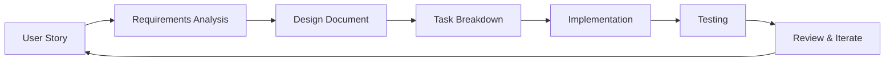

# Development Strategy: जीवनामृत Platform

## Strategic Development Approach

**Project**: Herb Identification Platform  
**Timeline**: 8-12 weeks  
**Team Size**: 1-3 developers  
**Methodology**: Agile with Kiro-assisted development  

## Phase-Based Development Plan

### Phase 1: Foundation & Core Features (Weeks 1-3)
**Goal**: Establish solid foundation with basic herb identification

#### Week 1: Project Setup & Authentication
- [ ] Enhanced project structure and TypeScript configuration
- [ ] Supabase integration with authentication
- [ ] Basic UI components and responsive design
- [ ] Protected routing implementation

**Kiro Usage**:
- Spec-driven development for authentication requirements
- AI-assisted component generation
- Automated test case creation

#### Week 2: Image Processing & AI Integration
- [ ] Camera capture and file upload functionality
- [ ] Image validation and preprocessing
- [ ] Google Gemini AI integration
- [ ] Basic herb identification workflow

**Kiro Usage**:
- AI flow optimization and error handling
- Property-based test generation
- Performance monitoring setup

#### Week 3: Results Display & Basic Reports
- [ ] Comprehensive results display component
- [ ] Basic PDF report generation
- [ ] Data persistence to Supabase
- [ ] User profile and history basics

**Kiro Usage**:
- UI component refinement
- Database schema optimization
- Integration testing automation

### Phase 2: Advanced Features & AI Enhancement (Weeks 4-6)
**Goal**: Implement advanced AI features and chatbot

#### Week 4: Parallel AI Processing
- [ ] Categorization flow implementation
- [ ] Ayurvedic applications flow
- [ ] Parallel processing optimization
- [ ] Environmental context integration

**Kiro Usage**:
- AI prompt engineering assistance
- Performance optimization suggestions
- Error handling pattern implementation

#### Week 5: Aranya Chatbot System
- [ ] Conversational AI implementation
- [ ] Context management and history
- [ ] Markdown formatting and UI
- [ ] Scope enforcement and safety measures

**Kiro Usage**:
- Chatbot personality development
- Safety guardrail implementation
- Conversation flow testing

#### Week 6: Enhanced Reporting & Storage
- [ ] Advanced PDF report templates
- [ ] Image storage optimization
- [ ] Report management features
- [ ] Bulk operations and filtering

**Kiro Usage**:
- Template generation and customization
- Storage optimization strategies
- User experience enhancement

### Phase 3: Polish & Optimization (Weeks 7-8)
**Goal**: Performance optimization and user experience refinement

#### Week 7: Performance & Security
- [ ] Caching implementation
- [ ] Security audit and hardening
- [ ] Performance monitoring
- [ ] Error handling enhancement

**Kiro Usage**:
- Security vulnerability scanning
- Performance bottleneck identification
- Monitoring dashboard setup

#### Week 8: Testing & Deployment
- [ ] Comprehensive testing suite
- [ ] End-to-end testing
- [ ] Production deployment
- [ ] Documentation completion

**Kiro Usage**:
- Automated test generation
- Deployment pipeline setup
- Documentation automation

## Kiro IDE Integration Strategy

### 1. Spec-Driven Development


**Benefits**:
- Clear requirements traceability
- Systematic approach to complex features
- Built-in testing strategy
- User feedback integration

### 2. AI-Assisted Development
- **Code Generation**: Boilerplate and repetitive patterns
- **Test Creation**: Property-based and unit tests
- **Documentation**: API docs and user guides
- **Refactoring**: Code optimization and cleanup

### 3. Quality Assurance Integration
- **Automated Testing**: Property-based testing with fast-check
- **Code Review**: AI-assisted code quality checks
- **Performance Monitoring**: Real-time performance insights
- **Security Scanning**: Vulnerability detection and fixes

## Technical Implementation Strategy

### Architecture Decisions

#### 1. Frontend Architecture
```typescript
// Component Structure
src/
├── components/
│   ├── ui/           // Reusable UI components
│   ├── features/     // Feature-specific components
│   └── layouts/      // Layout components
├── hooks/            // Custom React hooks
├── lib/              // Utility libraries
├── types/            // TypeScript type definitions
└── app/              // Next.js app router pages
```

#### 2. State Management Strategy
- **Local State**: React hooks for component state
- **Server State**: Supabase real-time subscriptions
- **Global State**: Context API for authentication
- **Cache Management**: React Query for API caching

#### 3. AI Integration Pattern
```typescript
// AI Flow Architecture
interface AIFlow<Input, Output> {
  name: string;
  input: Input;
  process: (input: Input) => Promise<Output>;
  retry: RetryConfig;
  fallback: FallbackStrategy;
}

// Parallel Processing
const processHerbAnalysis = async (image: string) => {
  const [identification, categorization, ayurvedic] = await Promise.all([
    identifyHerb(image),
    categorizeHerb(herbName),
    getAyurvedicApplications(herbName, description)
  ]);
  
  return combineResults(identification, categorization, ayurvedic);
};
```

### Development Best Practices

#### 1. Code Quality Standards
- **TypeScript**: Strict mode with comprehensive typing
- **ESLint**: Airbnb configuration with custom rules
- **Prettier**: Consistent code formatting
- **Husky**: Pre-commit hooks for quality checks

#### 2. Testing Strategy
```typescript
// Property-Based Testing Example
describe('Herb Analysis', () => {
  test('Property: All analyses include required fields', () => {
    fc.assert(fc.property(
      fc.record({
        image: fc.base64String(),
        location: fc.option(fc.string()),
        weather: fc.option(fc.string())
      }),
      async (input) => {
        const result = await analyzeHerb(input);
        
        expect(result).toHaveProperty('identification.commonName');
        expect(result).toHaveProperty('identification.latinName');
        expect(result).toHaveProperty('identification.confidenceLevel');
        expect(result.identification.confidenceLevel).toBeGreaterThan(0);
        expect(result.identification.confidenceLevel).toBeLessThanOrEqual(1);
      }
    ), { numRuns: 100 });
  });
});
```

#### 3. Performance Optimization
- **Image Optimization**: Compression and format conversion
- **Lazy Loading**: Component and image lazy loading
- **Caching**: Multi-level caching strategy
- **Bundle Optimization**: Code splitting and tree shaking

## Risk Management

### Technical Risks

#### 1. AI API Limitations
**Risk**: Google Gemini API rate limits or availability issues
**Mitigation**: 
- Implement circuit breaker pattern
- Add retry mechanisms with exponential backoff
- Create fallback identification methods
- Monitor API usage and costs

#### 2. Performance at Scale
**Risk**: Slow response times with increased users
**Mitigation**:
- Implement comprehensive caching
- Optimize database queries
- Use CDN for static assets
- Monitor performance metrics

#### 3. Data Privacy Compliance
**Risk**: GDPR and privacy regulation compliance
**Mitigation**:
- Implement data minimization
- Add user consent management
- Create data export/deletion features
- Regular privacy audits

### Business Risks

#### 1. Cultural Accuracy
**Risk**: Inaccurate Ayurvedic information
**Mitigation**:
- Expert validation process
- Community review system
- Continuous content updates
- Disclaimer and safety warnings

#### 2. User Adoption
**Risk**: Low user engagement
**Mitigation**:
- User-centric design approach
- Educational content strategy
- Community building features
- Regular user feedback collection

## Success Metrics

### Technical Metrics
- **Performance**: < 3s page load time, < 30s analysis time
- **Reliability**: 99.9% uptime, < 1% error rate
- **Security**: Zero critical vulnerabilities
- **Code Quality**: > 90% test coverage, A-grade code quality

### Business Metrics
- **User Engagement**: > 70% return rate, > 5 min session time
- **Feature Usage**: > 80% analysis completion rate
- **Content Quality**: > 4.5/5 user satisfaction rating
- **Growth**: 20% month-over-month user growth

### Cultural Impact Metrics
- **Educational Value**: User knowledge improvement surveys
- **Cultural Preservation**: Traditional knowledge documentation
- **Community Building**: User-generated content and discussions
- **Expert Validation**: Professional endorsements and partnerships

## Conclusion

This development strategy leverages Kiro IDE's capabilities to create a systematic, quality-focused approach to building जीवनामृत. The combination of spec-driven development, AI assistance, and comprehensive testing ensures both technical excellence and cultural authenticity.

The phased approach allows for iterative improvement while maintaining focus on core functionality. Regular checkpoints and user feedback integration ensure the final product meets both technical requirements and user needs.

**Next Steps**:
1. Begin Phase 1 implementation
2. Set up Kiro IDE workspace with specs
3. Establish development environment
4. Start with authentication and basic UI components