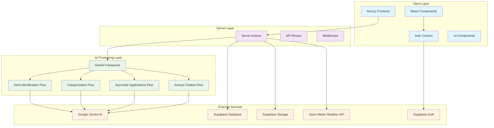

# Design Document

## Overview

जीवनामृत (Jeevanamrit) is architected as a modern full-stack web application that combines AI-powered image recognition with traditional Ayurvedic knowledge. The system uses Next.js 15 with the App Router for the frontend, Google Gemini AI for herb identification, and Supabase for authentication, database, and storage. The architecture emphasizes performance, security, and user experience while maintaining the cultural authenticity of Ayurvedic wisdom.

The platform follows a serverless architecture pattern with server actions handling business logic, parallel AI processing for optimal performance, and real-time data synchronization through Supabase. The design prioritizes mobile-first responsive design since users will primarily access the platform while exploring nature.

## Architecture

### System Architecture Diagram



### Data Flow Architecture

The system implements a unidirectional data flow with optimistic updates and real-time synchronization:

1. **Image Capture Flow**: User captures/uploads image → Location/weather data collected → Server action triggered
2. **AI Processing Flow**: Parallel execution of identification, categorization, and Ayurvedic analysis
3. **Data Persistence Flow**: Results saved to Supabase with image upload to storage
4. **Real-time Updates**: UI updates immediately with loading states and progress indicators

## Components and Interfaces

### Core Components

#### 1. Authentication System
```typescript
interface AuthContextType {
  user: User | null;
  session: Session | null;
  loading: boolean;
  signInWithGoogle: () => Promise<void>;
  logout: () => Promise<void>;
}
```

**Responsibilities:**
- Google OAuth integration via Supabase Auth
- Session management and persistence
- Route protection for authenticated features
- User profile synchronization

#### 2. Herb Analyzer Component
```typescript
interface HerbAnalyzerProps {
  onAnalysisComplete: (result: HerbAnalysisResult) => void;
  onError: (error: string) => void;
}

interface HerbAnalysisResult {
  identification: HerbIdentification;
  details: HerbDetails;
  category: HerbCategory;
  ayurvedic: AyurvedicApplications;
  metadata: AnalysisMetadata;
}
```

**Responsibilities:**
- Image capture and upload handling
- Location and weather data collection
- AI analysis orchestration
- Progress tracking and error handling

#### 3. Aranya Chatbot Component
```typescript
interface ChatMessage {
  id: string;
  role: 'user' | 'assistant';
  content: string;
  timestamp: Date;
}

interface ChatBotProps {
  initialMessages?: ChatMessage[];
  onMessageSent: (message: ChatMessage) => void;
}
```

**Responsibilities:**
- Conversational interface with typing indicators
- Message history management
- Markdown rendering for formatted responses
- Scope enforcement (botanical topics only)

#### 4. Report Generator Component
```typescript
interface ReportGeneratorProps {
  analysisData: HerbAnalysisResult;
  onPDFGenerated: (url: string) => void;
  onSaveComplete: (reportId: string) => void;
}
```

**Responsibilities:**
- PDF report generation using jsPDF
- Image embedding and formatting
- Report template management
- Cloud storage integration

### Interface Definitions

#### AI Flow Interfaces
```typescript
// Herb Identification Flow
interface IdentifyHerbInput {
  herbPhotoDataUri: string;
  locationDescription?: string;
  weatherDescription?: string;
}

interface IdentifyHerbOutput {
  identification: {
    commonName: string;
    latinName: string;
    confidenceLevel: number;
  };
  details: {
    uses: string;
    cultivation: string;
    origin: string;
    chemicalConstituents?: string[];
    history?: string;
    medicinalPreparations?: string;
  };
}

// Categorization Flow
interface CategorizeHerbInput {
  herbName: string;
}

interface CategorizeHerbOutput {
  medicinalProperties: string;
  cultivationMethods: string;
  preservationTechniques: string;
  category: string;
}

// Ayurvedic Applications Flow
interface AyurvedicApplicationsInput {
  herbName: string;
  herbDescription: string;
}

interface AyurvedicApplicationsOutput {
  ayurvedicApplications: string;
}

// Chatbot Flow
interface ChatbotInput {
  question: string;
}

type ChatbotOutput = string;
```

#### Database Interfaces
```typescript
interface HerbAnalysisRecord {
  id: string;
  user_id: string;
  user_email: string;
  common_name: string;
  latin_name: string;
  confidence_level: number;
  uses: string;
  cultivation: string;
  origin: string;
  chemical_constituents: string[];
  medicinal_properties: string;
  ayurvedic_applications: string;
  location_description?: string;
  weather_description?: string;
  image_url: string;
  created_at: string;
  updated_at: string;
}

interface UserProfile {
  id: string;
  email: string;
  display_name: string;
  photo_url: string;
  created_at: string;
  updated_at: string;
}
```

## Data Models

### Primary Data Models

#### 1. Herb Analysis Model
```typescript
class HerbAnalysis {
  id: string;
  userId: string;
  identification: {
    commonName: string;
    latinName: string;
    confidenceLevel: number;
  };
  details: {
    uses: string;
    cultivation: string;
    origin: string;
    chemicalConstituents: string[];
    history: string;
    medicinalPreparations: string;
  };
  category: {
    medicinalProperties: string;
    cultivationMethods: string;
    preservationTechniques: string;
    category: string;
  };
  ayurvedic: {
    applications: string;
  };
  metadata: {
    location?: string;
    weather?: string;
    imageUrl: string;
    createdAt: Date;
    updatedAt: Date;
  };
}
```

#### 2. User Model
```typescript
class User {
  id: string;
  email: string;
  displayName: string;
  photoUrl: string;
  analysisCount: number;
  createdAt: Date;
  updatedAt: Date;
  
  // Computed properties
  get recentAnalyses(): HerbAnalysis[];
  get favoriteHerbs(): string[];
}
```

#### 3. Chat Message Model
```typescript
class ChatMessage {
  id: string;
  userId: string;
  role: 'user' | 'assistant';
  content: string;
  createdAt: Date;
  
  // Methods
  toMarkdown(): string;
  extractPlantNames(): string[];
}
```

### Database Schema Design

#### Supabase Tables

**profiles table:**
- Primary key: `id` (UUID, references auth.users)
- Fields: `email`, `display_name`, `photo_url`, `created_at`, `updated_at`
- RLS: Users can only access their own profile

**herb_analyses table:**
- Primary key: `id` (UUID)
- Foreign key: `user_id` (references auth.users)
- Indexes: `user_id`, `created_at DESC`, `common_name`
- RLS: Users can only access their own analyses

**chat_messages table:**
- Primary key: `id` (UUID)
- Foreign key: `user_id` (references auth.users)
- Fields: `role`, `content`, `created_at`
- RLS: Users can only access their own messages

#### Storage Buckets

**herb-images bucket:**
- Organization: `{user_id}/{filename}`
- Access: Public read, authenticated write
- File types: PNG, JPEG, WebP
- Size limit: 10MB per image

## Correctness Properties

*A property is a characteristic or behavior that should hold true across all valid executions of a system-essentially, a formal statement about what the system should do. Properties serve as the bridge between human-readable specifications and machine-verifiable correctness guarantees.*

### Property-Based Testing Overview

Property-based testing (PBT) validates software correctness by testing universal properties across many generated inputs. Each property is a formal specification that should hold for all valid inputs.

### Property Reflection

After analyzing all acceptance criteria, I've identified several areas where properties can be consolidated to eliminate redundancy:

**Authentication Properties**: Requirements 1.2, 1.3, 1.4, 1.5 can be combined into comprehensive authentication behavior properties.

**Data Display Properties**: Requirements 4.1, 4.2, 4.3, 4.4, 4.5, 4.6 all test that complete information is displayed and can be consolidated into a comprehensive display completeness property.

**Report Generation Properties**: Requirements 5.1, 5.2, 5.3, 5.4, 5.5 all relate to report generation and can be combined into comprehensive report generation properties.

**Security Properties**: Requirements 9.2, 9.3, 9.4, 9.5 all test data security and can be consolidated into comprehensive security properties.

### Correctness Properties

Based on the prework analysis, here are the key correctness properties that validate our system requirements:

**Property 1: Authentication Session Management**
*For any* authenticated user, logging out and then attempting to access protected routes should result in redirection to the login page, and the user session should be completely cleared.
**Validates: Requirements 1.3, 1.5**

**Property 2: User Data Isolation**
*For any* authenticated user, all data access operations should only return data belonging to that user, and attempts to access other users' data should be denied.
**Validates: Requirements 9.2**

**Property 3: Image Processing Validation**
*For any* submitted image, the system should validate format and size constraints before processing, rejecting invalid images with appropriate error messages.
**Validates: Requirements 2.6**

**Property 4: AI Analysis Completeness**
*For any* successful herb identification, the result should contain common name, Latin name, confidence level, detailed uses, cultivation information, and chemical constituents.
**Validates: Requirements 3.2, 3.3, 4.1, 4.2, 4.3**

**Property 5: Parallel Processing Efficiency**
*For any* herb analysis request, the identification, categorization, and Ayurvedic application flows should execute in parallel rather than sequentially, improving overall processing time.
**Validates: Requirements 3.4**

**Property 6: Report Generation Completeness**
*For any* completed analysis, the generated PDF report should contain all analysis data, environmental context, appropriate disclaimers, and a unique filename.
**Validates: Requirements 5.1, 5.4, 5.5**

**Property 7: Database Persistence Consistency**
*For any* user analysis, the data should be saved to the database with proper user association, and the saved data should be retrievable and match the original analysis results.
**Validates: Requirements 5.2, 5.6**

**Property 8: Chatbot Scope Enforcement**
*For any* user question to the Aranya chatbot, responses should only be provided for plant, herb, and Ayurveda-related topics, with off-topic questions receiving polite redirections to botanical subjects.
**Validates: Requirements 6.1, 6.2**

**Property 9: Medical Disclaimer Inclusion**
*For any* health-related response from the chatbot, appropriate medical consultation disclaimers should be automatically included in the response.
**Validates: Requirements 6.3, 6.6**

**Property 10: Responsive Design Consistency**
*For any* screen size (mobile, tablet, desktop), all UI elements should remain readable, accessible, and functional with appropriate responsive adaptations.
**Validates: Requirements 8.1, 8.3**

**Property 11: Secure Communication Protocol**
*For any* network communication between client and server, HTTPS protocol should be used to ensure data transmission security.
**Validates: Requirements 9.3**

**Property 12: Performance Response Time**
*For any* herb analysis request under normal conditions, the processing should complete within 30 seconds with appropriate progress indicators shown to the user.
**Validates: Requirements 10.1, 10.3**

**Property 13: Error Recovery Mechanism**
*For any* failed AI request or network error, the system should implement retry mechanisms and provide clear error messages with recovery options to the user.
**Validates: Requirements 3.6, 10.4**

**Property 14: File Storage Organization**
*For any* uploaded herb image, the file should be stored in Supabase Storage with proper user-based organization and secure access controls.
**Validates: Requirements 5.3, 9.4**

**Property 15: User Profile Data Accuracy**
*For any* authenticated user, the profile display should accurately reflect their Google account information and show the correct count of their analyses.
**Validates: Requirements 7.1, 7.2**

## Error Handling

### Error Categories and Strategies

#### 1. Authentication Errors
- **OAuth Failures**: Redirect to error page with retry option
- **Session Expiry**: Automatic refresh attempt, fallback to re-authentication
- **Permission Denied**: Clear error messages with guidance

#### 2. AI Processing Errors
- **Image Analysis Failures**: Retry mechanism with exponential backoff
- **API Rate Limits**: Queue requests and inform user of delays
- **Invalid Images**: Client-side validation with format guidance

#### 3. Network and Connectivity Errors
- **Offline Detection**: Cache critical data and enable offline viewing
- **Slow Connections**: Progressive loading with timeout handling
- **API Unavailability**: Graceful degradation with cached responses

#### 4. Database and Storage Errors
- **Write Failures**: Retry with user notification
- **Storage Quota**: Clear messaging about limits and cleanup options
- **Data Corruption**: Validation and recovery procedures

#### 5. User Input Errors
- **Invalid File Types**: Real-time validation with helpful messages
- **Missing Required Data**: Progressive disclosure and guidance
- **Form Validation**: Immediate feedback with correction suggestions

### Error Recovery Patterns

```typescript
// Retry Pattern for AI Requests
async function withRetry<T>(
  operation: () => Promise<T>,
  maxRetries: number = 3,
  backoffMs: number = 1000
): Promise<T> {
  for (let attempt = 1; attempt <= maxRetries; attempt++) {
    try {
      return await operation();
    } catch (error) {
      if (attempt === maxRetries) throw error;
      await new Promise(resolve => setTimeout(resolve, backoffMs * attempt));
    }
  }
  throw new Error('Max retries exceeded');
}

// Circuit Breaker Pattern for External APIs
class CircuitBreaker {
  private failures = 0;
  private lastFailureTime = 0;
  private readonly threshold = 5;
  private readonly timeout = 60000; // 1 minute

  async execute<T>(operation: () => Promise<T>): Promise<T> {
    if (this.isOpen()) {
      throw new Error('Circuit breaker is open');
    }
    
    try {
      const result = await operation();
      this.onSuccess();
      return result;
    } catch (error) {
      this.onFailure();
      throw error;
    }
  }
  
  private isOpen(): boolean {
    return this.failures >= this.threshold && 
           (Date.now() - this.lastFailureTime) < this.timeout;
  }
}
```

## Testing Strategy

### Dual Testing Approach

The testing strategy combines unit tests for specific examples and edge cases with property-based tests for universal properties across all inputs. Both approaches are complementary and necessary for comprehensive coverage.

#### Unit Testing Focus
- **Specific Examples**: Test concrete scenarios with known inputs and expected outputs
- **Edge Cases**: Test boundary conditions, empty inputs, and error scenarios
- **Integration Points**: Test component interactions and API integrations
- **UI Interactions**: Test user workflows and interface behaviors

#### Property-Based Testing Focus
- **Universal Properties**: Test properties that should hold for all valid inputs
- **Input Space Coverage**: Generate diverse test cases automatically
- **Invariant Validation**: Ensure system invariants are maintained
- **Regression Prevention**: Catch edge cases that manual tests might miss

### Property-Based Testing Configuration

**Testing Library**: Fast-check for TypeScript/JavaScript property-based testing
**Test Iterations**: Minimum 100 iterations per property test
**Test Tagging**: Each property test tagged with format: **Feature: herb-identification-platform, Property {number}: {property_text}**

#### Example Property Test Structure
```typescript
import fc from 'fast-check';

describe('Feature: herb-identification-platform', () => {
  test('Property 2: User Data Isolation', () => {
    fc.assert(fc.property(
      fc.record({
        userId: fc.uuid(),
        otherUserId: fc.uuid(),
        analysisData: fc.record({
          commonName: fc.string(),
          latinName: fc.string(),
          confidenceLevel: fc.float(0, 1)
        })
      }),
      async ({ userId, otherUserId, analysisData }) => {
        // Assume userId !== otherUserId
        fc.pre(userId !== otherUserId);
        
        // Save analysis for userId
        await saveAnalysis(userId, analysisData);
        
        // Attempt to access as otherUserId
        const result = await getUserAnalyses(otherUserId);
        
        // Should not contain the analysis
        expect(result.find(a => a.commonName === analysisData.commonName)).toBeUndefined();
      }
    ), { numRuns: 100 });
  });
});
```

### Testing Environments

#### Development Testing
- **Unit Tests**: Jest with React Testing Library
- **Property Tests**: Fast-check integration
- **E2E Tests**: Playwright for critical user journeys
- **Visual Regression**: Chromatic for UI consistency

#### Staging Testing
- **Load Testing**: Artillery.js for performance validation
- **Security Testing**: OWASP ZAP for vulnerability scanning
- **API Testing**: Postman collections for endpoint validation
- **Mobile Testing**: BrowserStack for device compatibility

#### Production Monitoring
- **Error Tracking**: Sentry for runtime error monitoring
- **Performance Monitoring**: Vercel Analytics for Core Web Vitals
- **Uptime Monitoring**: Pingdom for availability tracking
- **User Analytics**: Privacy-focused analytics for usage patterns

### Test Data Management

#### Test Data Generation
```typescript
// Herb Analysis Test Data Generator
const generateHerbAnalysis = () => fc.record({
  identification: fc.record({
    commonName: fc.constantFrom('Tulsi', 'Neem', 'Ashwagandha', 'Turmeric'),
    latinName: fc.constantFrom('Ocimum sanctum', 'Azadirachta indica'),
    confidenceLevel: fc.float(0.7, 1.0)
  }),
  details: fc.record({
    uses: fc.lorem(50, 200),
    cultivation: fc.lorem(30, 100),
    origin: fc.constantFrom('India', 'Southeast Asia', 'Himalayas')
  })
});

// User Test Data Generator
const generateUser = () => fc.record({
  id: fc.uuid(),
  email: fc.emailAddress(),
  displayName: fc.fullName(),
  photoUrl: fc.webUrl()
});
```

#### Mock Data Services
```typescript
// AI Service Mock for Testing
class MockAIService {
  async identifyHerb(imageData: string): Promise<HerbIdentification> {
    // Deterministic responses based on image hash for consistent testing
    const hash = hashString(imageData);
    return this.getResponseForHash(hash);
  }
  
  private getResponseForHash(hash: string): HerbIdentification {
    // Return consistent mock data based on hash
    const responses = [
      { commonName: 'Tulsi', latinName: 'Ocimum sanctum', confidenceLevel: 0.95 },
      { commonName: 'Neem', latinName: 'Azadirachta indica', confidenceLevel: 0.88 }
    ];
    return responses[hash % responses.length];
  }
}
```

This comprehensive testing strategy ensures both specific functionality validation through unit tests and universal correctness validation through property-based testing, providing robust coverage for the जीवनामृत platform.